<h1 align="center">
   
  Tasarım Kalıpları
   
</h1>

<h5 align="center">

Tasarım Kalıpları Nedir ve Neden Kullanmalıyız?

Tasarım kalıpları, yazılım geliştiricilerinin karşılaştıkları genel sorunların çözümüdür. Bu çözümler, uzun bir süre boyunca sayısız yazılım geliştiricisi tarafından kullanılmış ve test edilmiştir.Bu kalıplar Nesne yönelimli bir yapı oluştururken tasarımınızın hangi sorunlar ile karşılaşacağı ve bu sorunların üstesinden nasıl gelmeniz gerektiği konusunda size yol gösteren mantık şemalarıdır.

Kısaca tekerleği yeniden icat etmek istemiyorsak yani yazılımcıların karşılaştığı genel sorunları tekrar tekrar yaşamak istemiyorsak bu kalıpları öğrenmeliyiz. Tabii ki bu kalıpları kullanmak karşınıza çıkan problemleri çözmek için tam anlamıyla bir çözüm sunmayacaktır ama işinizi çok daha kolaylaştıracağını söyleyebilirim.

Bu repo içerisinde tasarım kalıplarını açıklamaya çalıştım. Her tasarım kalıbına ait TypeScript programlama diliyle yazılmış örnekler bulunmakta. Bu örnekler genellikle UML şemaları ile birlikte verilmiştir.

</h5>

<ol>
  <li>
  <a href = '#factory-method-design-pattern'>Factory Method Design Pattern</a>
  </li>
  <li>
  <a href = '#abstract-factory-design-pattern'>Abstract Factory Design Pattern</a>
  </li>
  <li>
  <a href = '#builder-design-pattern'>Builder Design Pattern</a>
  </li>
  <li>
  <a href = '#prototype-design-pattern'>Prototype Design Pattern</a>
  </li>
  <li>
  <a href = '#singleton-design-pattern'>Singleton Design Pattern</a>
  </li>
  <li>
  <a href = '#adapter-design-pattern'>Adapter Design Pattern</a>
  </li>
  <li>
  <a href = '#bridge-design-pattern'>Bridge Design Pattern</a>
  </li>
  <li>
  <a href = '#composite-design-pattern'>Composite Design Pattern</a>
  </li>
  <li>
  <a href = '#decorator-design-pattern'>Decorator Design Pattern</a>
  </li>
  <li>
  <a href = '#facade-design-pattern'>Facade Design Pattern</a>
  </li>
  <li>
  <a href = '#flyweight-design-pattern'>Flyweight Design Pattern</a>
  </li>
  <li>
  <a href = '#proxy-design-pattern'>Proxy Design Pattern</a>
  </li>
  <li>
  <a href = '#chain-of-responsibility-design-pattern'>Chain of Responsibility Design Pattern</a>
  </li>
  <li>
  <a href = '#command-design-pattern'>Command Design Pattern</a>
  </li>
  <li>
  <a href = '#memento-design-pattern'>Memento Design Pattern</a>
  </li>
  <li>
  <a href = '#observer-design-pattern'>Observer Design Pattern</a>
  </li>
  <li>
  <a href = '#template-method-design-pattern'>Template Method Design Pattern</a>
  </li>
  <li>
  <a href = '#visitor-design-pattern'>Visitor Design Pattern</a>
  </li>
  <li>
  <a href = '#iterator-design-pattern'>Iterator Design Pattern</a>
  </li>
  <li>
  <a href = '#mediator-design-pattern'>Mediator Design Pattern</a>
  </li>
  <li>
  <a href = '#state-design-pattern'>State Design Pattern</a>
  </li>
  <li>
  <a href = '#strategy-design-pattern'>Strategy Design Pattern</a>
  </li>
</ol>

## Factory Method Design Pattern

Factory Metodunu bir günlük hayat senaryosu ile açıklamaya çalışacağız. Bir lojistik şirketi için nakliye kamyonlarına ait bir ekosistemi programladığınızı düşünün. Nesne yönelimli kodunuzu "Kamyonet" isimli bir sınıfa(class) göre kurduğumuzu düşünelim. 

İşler iyi gitti ve çalıştığınız şirket aksiyonlarını büyütmeye karar verdi. Artık şirketiniz deniz nakliyesi yapmak amacıyla gemiler ile de çalışıyor. Bu gemileri ekosisteminize dahil etmeniz gerek ama siz kodunuzu "Kamyonet" nesne yönelimli yapınızı kamyonet sınıfı üzerine kurgulamıştınız. Bu durumda gemileri ekosisteminize dahil etmek için kodunuzu değiştirmek zorunda kalacaksınız. Bu durumda kodunuzun esnekliğini kaybedeceksiniz. Belki de binlerce satır kodunuzu değiştirmek ve günlerce hata ayıklamak zorunda kalacaksınız :(

Factory Metodu tam da bu gibi durumlara uygun bir tasarım kalıbıdır. Eğer elinizde sürekli genişleyen veya genişleyebilecek bir ekosistem varsa bu kalıbı kullanabilirsiniz. 

Factory Metodu bu sorunu çözmek için obje oluşturma işlemlerimizi özel bir sınıfa(class) taşır. Bu sınıfın adı "Fabrika" olabilir. Bu fabrika sınıfı içerisinde obje oluşturma işlemlerimizi gerçekleştiririz. Ama bu işlemi yaparken objelerimizi aynı interface üzerinden türetmeliyiz.

Yukarıdaki verdiğimiz senaryodaki kişi bu yapımızı en baştan uygulasaydı, nakliye şirketi operasyonlarını büyütmek istediğinde bir sıkıntı yaşamayacaktı. Sadece yeni sınıflar ekleyerek işlerini halledebilirdi. 

##### Factory Pattern Kullanım Senaryoları

- Eğer kullanacağınız sınıfları önceden tam olarak bilmiyorsanız
- Eğer kullanıcılara geliştirip büyütebilecekleri bir kütüphane veya framework sunmak istiyorsanız
- Sistem kaynaklarından tasarruf etmek ve her seferinde bir sınıfı sıfırdan yazmak istemiyorsanız

! Factory Methodun tek eksiği kodunuzu karmaşıklaştırmasıdır ama bunun dışında çok kullanışlı bir tasarım kalıbıdır.

## Abstract Factory Design Pattern

Abstract Factory Metodu birbirine bağlı olan nesneleri üretmek için kullanılır. Örneğin bir araba üretirken motor ve tekerlekleri de üretmeliyiz. Yani elimizde belirli bir kalıp var. Bu durumda terimsel olarak abstract kelimesini kalıp olarak çevirilebilir.

Metodumuzu yine bir günlük hayat senaryosuyla açıklamaya çalışalım. Bir antika dükkanının satış uygulamasını kodladığınız düşünün. Dükkanda şimdilik Osmanlı ve Viktorya stili mobilyalarımız bulunsun. Bu mobilyaların hepsinin ortak özellikleri var. Bunlar; "Koltuk", "Sandalye" olabilir. Ama bu mobilyaların hepsinin ortak özellikleri dışında farklı özellikleri de var. Örneğin Osmanlı stili koltuklarımızın koltuk kısmı deri olabilir. Viktorya stili koltuklarımızın koltuk kısmı ise kumaş olabilir. Eğer programımızı sadece bu 2 tip mobilyaya göre tasarlamış olsaydık, her yeni mobilya tipi için kodumuzu değiştirmek zorunda kalacaktık. Bu durumda kodumuzun esnekliğini kaybedecektik.

Ayrıca uygulamayı yaparken ekibimizde 2 yazılımcı daha çalıştığını varsayalım. Bu yazılımcılardan birinin müşterilere satış yapılan sayfayı kodladığını diğerinin ise ürünün nakliyesi ile işlemleri kodladığını düşünelim. Bu durumda sınıfların hiyerarşik yapısını kodlamak size ait olacaktır. Projede çalışan diğer yazılımcılar sizden kolay bir kullanım arayüzü, bir nevi API bekleyecektir. Böyle bir senaryoda Abstract Factory Metodu size yardımcı olacaktır.

Abstract Factory Metodu isminden de anlaşılacağı üzere Factory Metodu ile benzerlik gösterir. Factory Metodundan farklı olarak clien'ın (yukarıda verdiğimiz senaryoda diğer yazılımcıların) sadece abstract sınıf ile muhatap olmasını sağlar. Yukarıdaki şemada nakliyeci taşıdığı mobilyaların tipleri ile ilgilenmez. Sadece mobilya sınıfı ile muhatap olur. Bu sayede client'ın kodu daha düzenli olur. Ayrıca yeni bir mobilya tipi eklenmesi durumunda client'ın kodunu değiştirmek zorunda kalmazsınız. Sadece yeni mobilya sınıfını yazmanız yeterli olacaktır. 

Bu metod biraz karışık olduğu için bir örnek daha verelim. Platform bağımsız bir arayüz uygulamamız olsun. Arayüz bileşenlerimiz Windows ve Mac için farklı olabilir. Mesela butonlarımız Windows için 3D, Mac için ise 2D olabilir. Bunlar için ayrı ayrı sınıflar yazmak yerine Abstract Factory Metodu ile tek bir sınıf içerisinde iki farklı sınıfı üretebiliriz. Bu sayede client'ın kodunu değiştirmek zorunda kalmadan yeni bir platform ekleyebiliriz. 

Abstract Factory &nbsp; &nbsp; &nbsp; &nbsp; &nbsp; &nbsp; &nbsp; &nbsp; &nbsp; &nbsp; &nbsp; &nbsp; &nbsp; &nbsp; &nbsp;&nbsp; &nbsp; &nbsp; &nbsp; &nbsp; &nbsp; | Factory Method
-------|-------------------
Bir dizi benzer ürünleri oluşturmak için kullanılabilir. Örneğin bir otomobil üreticisi, farklı otomobil modelleri oluşturmak için abstract factory kullanır. | Bir ürün sınıfının alt sınıflarını oluşturmak için kullanılır. Örneğin bir otomobil üreticisi, aynı otomobil modelinin farklı tasarımlarını oluşturmak için kullanır.
Sınıf yapısı daha kapsamlıdır. | Genellikle tek metot içerir.
Daha az özelleştirilebilir bir yapıya sahiptir çünkü belirli bir kalıba bağlıdır. | Daha fazla özelleştirme imkanı sunar.

## Builder Design Pattern

Builder metodu bir nesnenin oluşturulması sırasında aşamaları açıkça ayırır ve bu şekilde nesne oluşturma işlemini daha okunaklı ve anlaşılır bir kod yapısına döker. Aynı nesne oluşturma kalıbını kullanarak birçok farklı tipte objeler üretmenizi sağlar.

'Ev' isimli bir nesne kodladığınızı düşünün. 'Ev' nesnesinin pencereSayısı, odaSayısı, katSayısı, çiftKatlıMı, garajıVarMı, havuzuVarMı, BahçesiVarMı, DoğalGazBağlıMı ... gibi birçok özelliği vardır. Bu nesneyi oluştururken fark edeceksiniz ki constructor fonksiyonunuz çok uzun ve karmaşık bir hal almış yani 'Telescoping Constructor' probleminden muzdaripsiniz. Kodu siz yazdığınız halde sizin bile yeni bir ev nesnesi tanımlarken kafanız karışıyor.

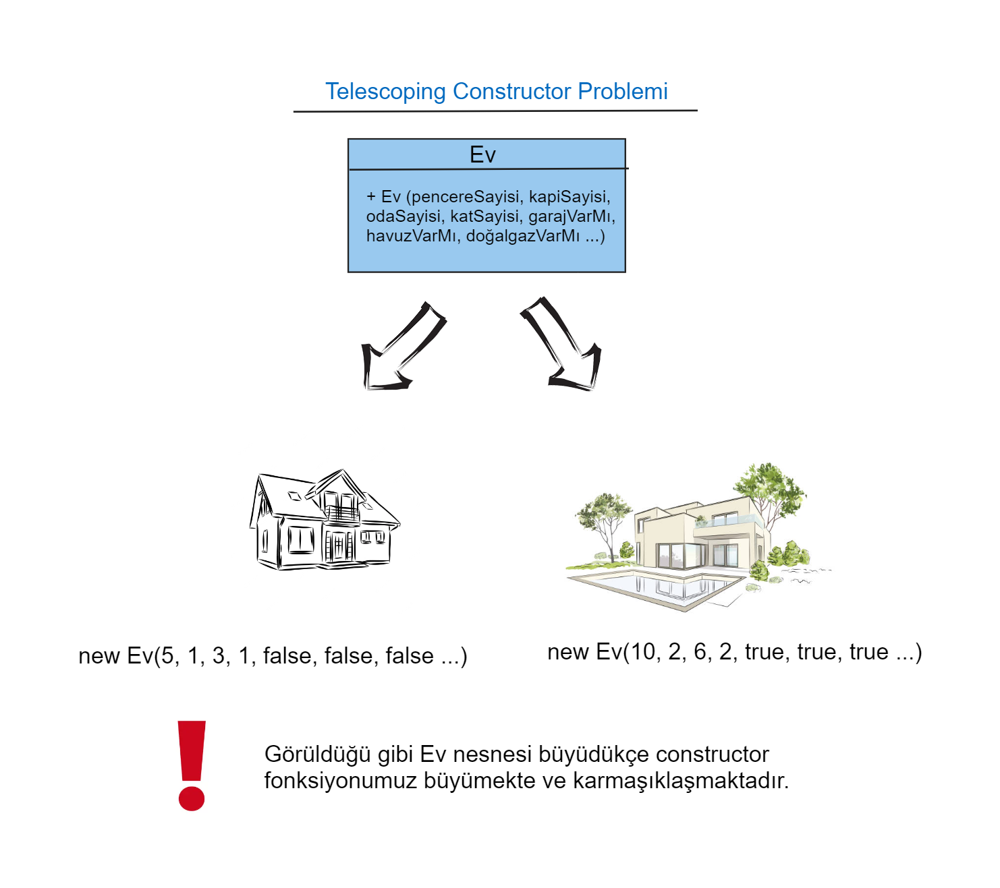

Builder metodu bu karmaşıklığı önlemede size yardımcı olacaktır. Çalışma metodu olarak nesne oluşturma işlemini aşamalara bölme prensibini benimser. Bu aşamaları birer fonksiyon olarak tanımlar ve bu fonksiyonları kullanarak nesneyi oluşturur. Bu sayede nesne oluşturma işlemini daha okunaklı ve anlaşılır bir kod yapısına döker. Aynı nesne oluşturma kalıbını kullanarak birçok farklı tipte objeler üretmenizi sağlar.

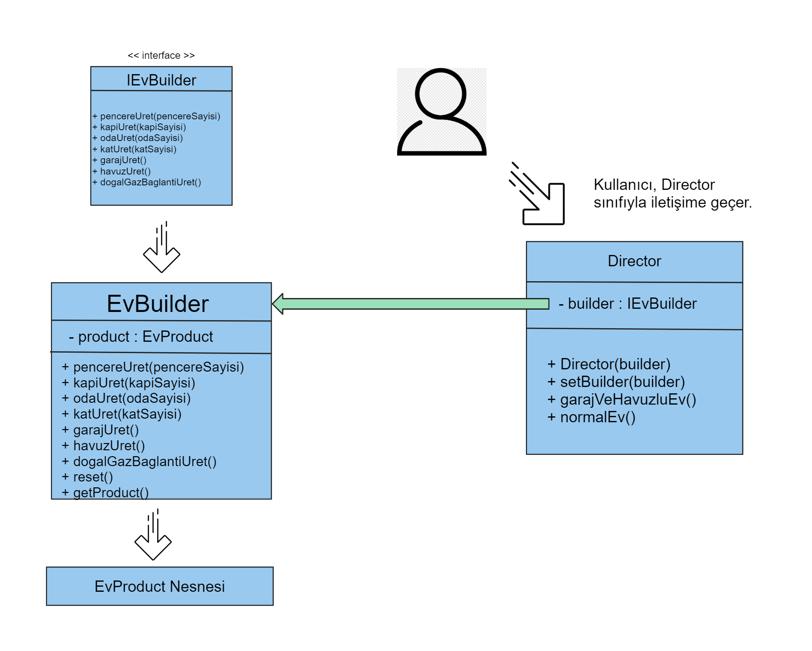

* Builder metodu, 'Single Responsibility' prensibine uygun bir tasarım desenidir. Nesneyi oluştururken kompleks adımları birbirinden ayırırız ve her adımdan sorumlu tek bir fonksiyon tanımlarız.

## Prototype Design Pattern

Prototype tasarım kalıbı varolan bir nesnesin kopyası alır ama sizi o sınıfa olan bağımlılıktan kurtarır. 

Diyelim kodunuz içerisinde bir sınıf üzerinde testler yapmak istiyorsunuz ve sınıfınızın bu testlerden etkilenmesini istemiyorsunuz. Bu durumda kod içerisinde bu sınıfı bulup kodlarını kopyalayıp yeni bir sınıf oluşturmayı aklınıza getirdiyseniz bunun kötü bir yaklaşım olacağını söyleyelim. Eğer bu şekilde kopyala yapıştır yaparsanız yeni sınıfınız eski sınıfın tüm bağımlılıklarını kopyalacaktır. Bunun yapacağınız testlere etki edeceğini söyleyebiliriz.

Prototype tasarım kalıbı klonlama işlemlerini destekleyen tüm fonksiyonlar için bir ortak interface sunar. Böylece siz sınıfı tek bir clone() fonksiyonuyla klonlamış olursunuz ve bağımlılıklarınızı kopyalamazsınız. Hatta birçok programlama dili aynı sınıftan türetilmiş nesnelerin private özellikleri kopyalamasını desteklediğinden dolayı private değişkenleri kopyalayabilirsiniz. 

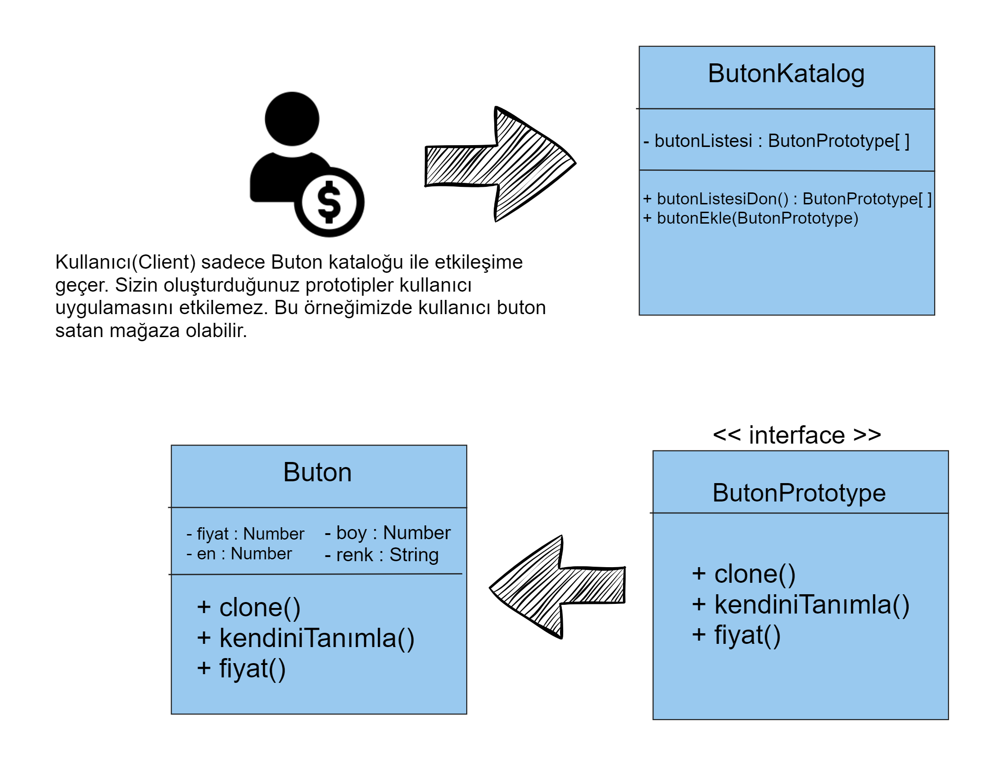

* Prototype tasarım kalıbını kopyalamak istediğiniz sınıfın 'Concrete' sınıfa bağımlı olmasını istemediğinizde kullanabilirsiniz. 

* Prototype tasarım kalıbını sadece başlatılma(initialize) biçimleri değişen birçok alt-sınıfı azaltmak istediğinizde kullanabilirsiniz. 

## Singleton Design Pattern

Singleton tasarım kalıbı, bir sınıfı ait sadece bir nesne oluşturulmasını sağlar. Oluşturulan tek nesne global tanımlanan bir işaretçi(pointer) üzerinden erişilebilir.

Bir sınıfa ait tek bir nesne olmasını neden isteyebiliriz ? Bazı paylaşılan kaynaklara erişmek istediğimizde bu kalıbı kullanabiliriz. Örneğin bir veritabanı bağlantısı, bir dosya sistemi, bir log kaydı gibi. Bu kaynaklara erişmek amacıyla her nesne için ayrı bir nesne oluşturmak yerine tek bir nesne üzerinden erişmek daha mantıklı olacaktır. Birden fazla nesnemiz olsaydı bir nesne üzerinde değişiklik yaptığımızda diğerleri üzerinde de yapmak zorunda kalacaktık. Bu özelliği sınıfların constructor fonksiyonları ile yapamayız. Constructor fonksiyonları sınıfın herhangi bir nesnesi oluşturulduğunda çalışır. Bu nedenle sınıfın tek bir nesnesi oluşturulmasını sağlamak için sınıf içerisinde static bir değişken tanımlarız.

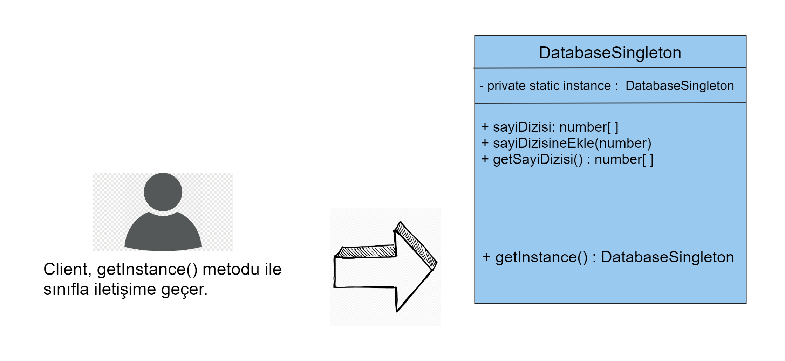

* Singleton tasarım kalıbını bir sınıfın sadece tek bir nesnesi olmasını istediğinizde kullanabilirsiniz. Global değişkenler yerine bu kalıbı kullanabilirsiniz. Global değişkenlerin aksine Singleton kalıbı nesnenin tanımlandığını garanti eder. Uygulanması kolay bir tasarım kalıbıdır.

* Singleton tasarım kalıbı 'Single Responsibility' prensibini ihlal eder. Programınızın Multithread bir çalışma yapısı varsa nesnenin iki kez tanımlanamayacağından size sıkıntı çıkarabilir. 

* Birçok framework Unit Test yazımında Miras Alma(Inheritance) özelliğini kullandığından Singleton metodlarının bir kopyasını oluşturamaz. Bu yüzden de Singleton metodlarını Unit Test yazarken kullanamazsınız.

## Adapter Design Pattern

Adapter tasarım kalıbı, bir sınıfın üyelerini başka bir sınıfın üyelerine uyumlu hale getirme amacı ile kullanılan bir tasarım kalıbıdır. Bu tasarım deseni, farklı sınıflar arasında uyumsuzluğu azaltır veya ortadan kaldırır.

Gerçek hayatta birçok durumda farklı sınıflar arasında uyumsuzluklar oluşur. Örneğin borsayı takip eden bir uygulamanız olsun. Siz verilerinizi bir API üzerinden XML formatında alıyorsunuz ama kullandığınız istatistik kütüphanesi ya da verileri göstermek için kullandığınız grafik kütüphanesi JSON formatında verileri kabul ediyor. Bu durumda verileri XML formatından JSON formatına çevirmeniz gerekecektir. Bu çevirme işlemini yapmak için bir adapter tasarım kalıbı kullanabilirsiniz.

Biz bu kadar geniş çaplı bir örnek yapmayacağız. Örneğin A ve B isimli veri saklamak için kullandığımız iki formatımız olsun. A formatında verileri virgülle ayırıp dosyaya yazarken B formatında verileri noktayla ayırıp dosyaya yazıyoruz. Bu iki formatı birbirine uyumlu hale getirmek için bir adapter tasarım kalıbı kullanabiliriz.

* Adapter Metodu 'Single Responsibility' prensibi ile uyumludur. Sınıflar arası uyum işlemini tek bir ara sınıfa yüklemiş oluruz. 
* Adapter Metodu 'Open/Closed' prensibini benimser. Önceden oluşturulmuş sınıflar üzerinde değişiklik yapmadan yeni Adapter sınıfları ekleyebiliriz. 

## Bridge Design Pattern

Bridge tasarım kalıbı, büyük bir sınıfı ya da küçük sınıflardan oluşan bir yapıyı 'Abstraction' ve 'Implementation' olarak iki farklı hiyerarşiye ayırmayı amaçlar. Bu ayırma işleminden sonra iki farklı grup birbirinden bağımsız olarak geliştirilebilir. 

Basit bir örnekle açıklamak istersek diyelim ki 'Şekil' isimli bir interface sınıfımız olsun. Bu sınıftan renklere ve şekillere göre sınıflar türetmek istiyoruz. Mesela şekillerimiz Küp, Küre olsun renklerimiz de Mavi, Kırmızı olsun. Bu durumda 4 sınıfımız ortaya çıkacaktır. (MaviKüp, KırmızıKüp ...)

Bu şekilde sınıflarımızı oluşturduğumuzda yeni bir şekil eklemek istediğimizde ya da yeni bir renk eklemek istediğimizde sınıflarımızın sayısı artacaktır. Bu iki özelliği ayrı ayrı sınıf kümelerine ayırsak ve birbiri ile ilişki kursaydık bu sorunu çözebilirdik. 

Bu kalıbın gerçek hayatta kullanımına bir örnek verecek olursak platform bağımsız bir yazılım geliştiriyorsunuz. Bu yazılımı Windows, Linux ve Mac OS için geliştirmek istiyorsunuz. Bu durumda yazılımınızı platform bağımsız yani sadece uygulamayı geliştirdiğiniz kısıma ve platforma bağlı fonksiyonları ve sınıfları yazdığınız kısım olarak iki ayrı bölüme ayırabilirsiniz. Bu iki kısımdan biri değiştiğinde diğer kısımda değişiklik olmayacaktır. Hatta bu tasarım kalıbı ile birlikte bu kısımlar ayrı yazılım ekipleri tarafından geliştirilebilir. 

Konuya veribileceğimiz bir diğer örnek ise kumanda ve televizyon-radyo arasındaki örnek verilebilir. Kumanda, Bridge tasarım kalıbının Abstraction kısmı, Televizyon veya Radyo ise Implementation kısmını oluşturur. Kumanda sınıfı televizyon ve radyo sınıflarından bağımsız olarak geliştirilir. 

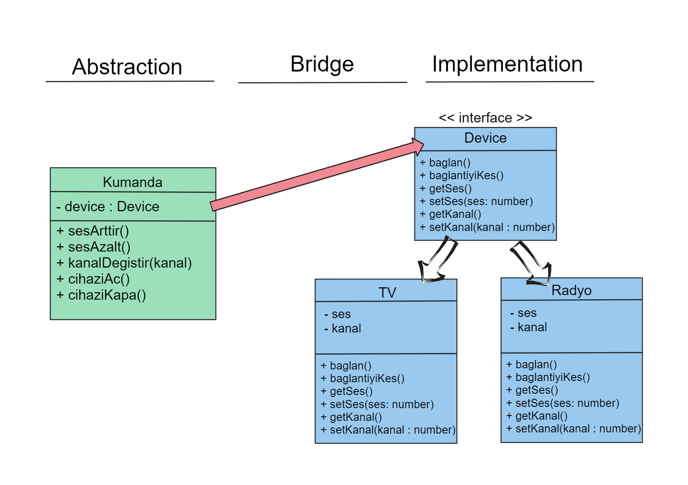

* Bridge tasarım kalıbını bir sınıf kümeniz birçok farklı sınıf kümesi ile ilişki kuruyorsa kullanabilirisiniz. Örneğin birçok veritabanı sistemine bağlanan bir sınıf kümeniz varsa. 

* Bridge tasarım kalıbını platform bağımsız uygulamalar ve sınıflar yazmak için kullanabilirsiniz. 

* Bridge tasarım kalıbı, SOLID presiplerinden 'Open/Closed' ve 'Single Responsibility' ilkelerini benimser.

## Composite Design Pattern

Composite tasarım kalıbı, birbirlerine hiyerarşik olarak bağlı nesneleri bir ağaç yapısında birleştirmeyi amaçlar. Birbirlerine bağlı düğümler ortak bir interface üzerinden işlemler yaparlar.
Oluşturduğumuz hiyerarşik yapıda 'Leaf'(yaprak) ve 'Composite'(bileşik) olarak iki farklı sınıf yapısı bulunur. Leaf sınıfı hiyerarşik yapının en alt seviyesindeki sınıftır. Composite ise kendisinden türeyen sınıfları birbirine bağlayan sınıftır. 

Gerçek hayatta benzer bir yapıyı orduda görebiliriz. Ordu içerisinde mutlak bir hiyerarşi bulunmaktadır. Bu hiyerarşide en üst seviyede komutanlar bulunur. Komutanlar altında da subaylar bulunur. Subaylar altında da askerler bulunur. Bu hiyerarşideki her bir sınıf kendisinden türeyen sınıfları birbirine bağlar. Komutanın verdiği emir subaylara ulaşır. Subaylar da bu emiri sorumlu olduğu askerlere ulaştırır. 

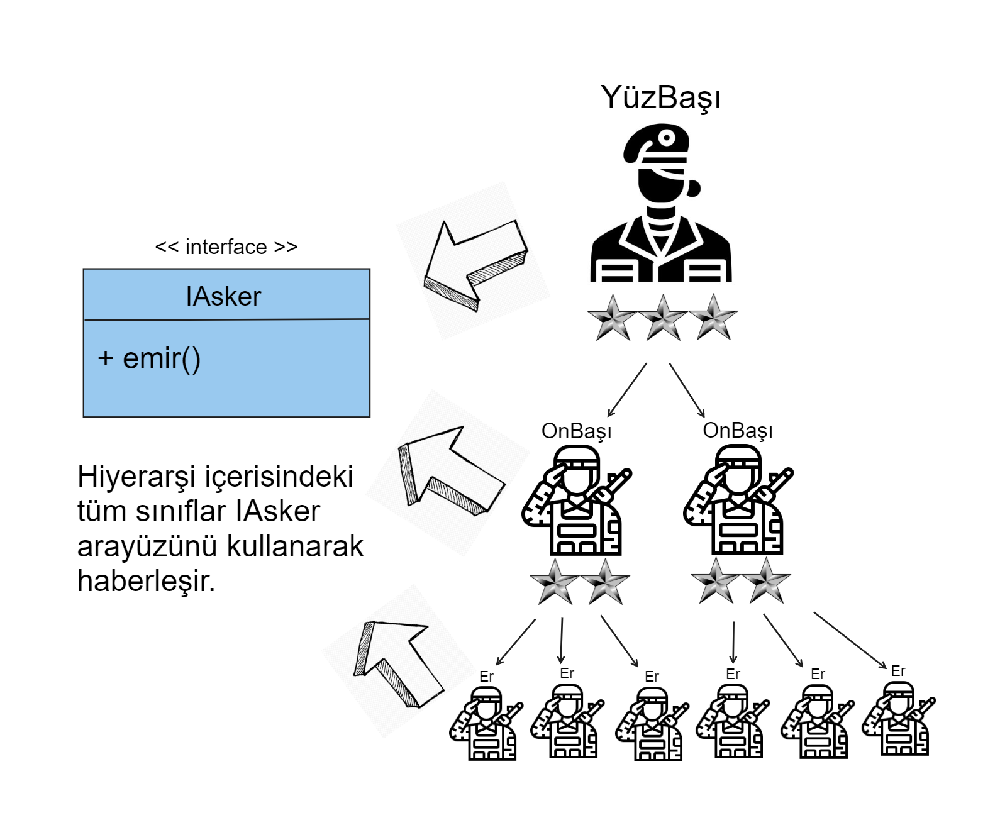

Yazılım konusunda verilebileceğimiz bir örnek ise dosya sistemi olabilir. Dosya sisteminde en üst seviyede klasörler bulunur. Klasörler altında dosyalar bulunur.

* Composite tasarım kalıbını uygulamanız bir ağaç yapısıyla ifade edilebilirse kullanın. 

* Composite tasarım kalıbını kompleks ve basit birimlere aynı interface üzerinden erişmek istediğinizde kullanabilirsiniz.

* Composite tasarım kalıbı ile karmaşık ağaç yapısı fonksiyonlarını kullanabilirsiniz. PolyMorphism ilkesini ve Recursive fonksiyonlarını lehinize kullanabilirsiniz.

* Composite tasarım kalıbı, SOLID prensiplerinden 'Open/Closed' ilkesini benimser.

## Decorator Design Pattern

Decorator tasarım kalıbı, bir nesneye yeni davranışlar eklemek için özel sarıcı(wrapper) sınıflar kullanır. Bu sınıflar nesneye yeni davranışlar eklerken, nesnenin eski davranışlarını değiştirmeden yeni davranışlar ekler. Bunu matruşka bebekler gibi düşünebiliriz. 

Daha büyük bir matruşka bebek aracılığıyla bebeğimizi büyütebiliriz. Bu büyüme işlemi sırasında eski matruşka bebek aynı kalır. Matruşka bebekleri açmayı fonksiyonlarımızı çağırmak olarak düşünebiliriz. Her bir matruşka bebek daha küçük matruşka bebekleri çağırır ta ki en küçük matruşka bebeğe ulaşana kadar. 

Örneğin uygulamanız için bir notifikasyon kütüphanesi yazdığınızı düşünün. Başlangıçta uygulamanız bildirimleri sadece mail aracılığıyla gönderiyordu. Bir süre sonra işler iyi gitti ve uygulamanız popülerleşti. Artık kullanıcılar SMS, Facebook veya Slack notifikasyonları almak istiyorlar. Bu durumda eski yazdığınız kütüphaneyi değiştirmek zaman alıcı ve riskli bir işlem olacaktır. Notifikasyon göndermeniz gereken kaynak sayısı arttıkça permütasyon olasılıklarınız da artacaktır. Çünkü bir kullanıcı sadece mail ve Facebook bildirimi isteyebilir ya da sadece Facebook, Slack bildirimi isteyebilir. Bu permütasyonları yönetmek iyice işin içinden çıkılmaz bir hale gelecektir. İşte bu gibi durumlarda Decarator tasarım kalıbı imdadımıza yetişiyor.

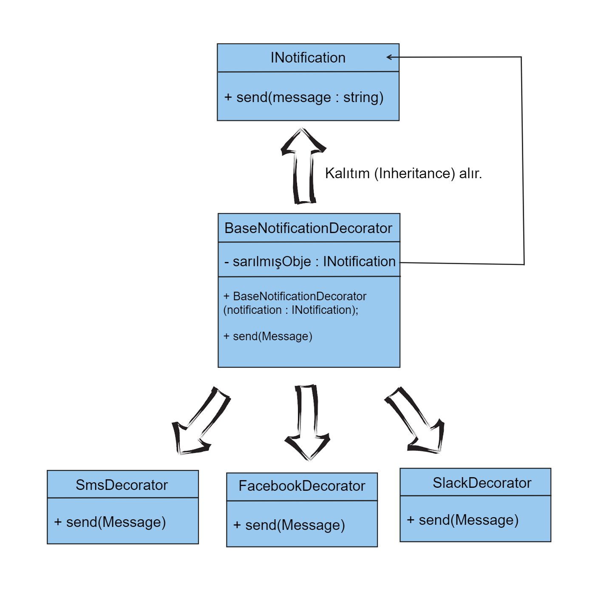

* Decorator tasarım kalıbını sınıflarda kullanılan kodu değiştirmeden yeni davranışlar eklemek istediğinizde kullanabilirsiniz.

* Eğer Kalıtım(Inheritance) yoluyla bir nesneyi genişletmek mümkün değilse Decorator tasarım kalıbını kullanabilirsiniz. Bazı programlama dillerindeki 'final' keyword'ü sınıflardan kalıtım alınmasını engelleyebilir. 

* Decorator ile Yeni bir alt-sınıf oluşturmadan bir objenini davranışlarını kopyalayabilirsiniz.

* Birçok davranışı Decorator sınıflar aracılığıyla aynı anda kullanabilirsiniz.

* Wrapper(Obje Sarıcı) sınıflar oluşturulduktan sonra silinmesi zordur. Bu yüzden wrapper sınıfları kullanırken dikkat edin !

* Decorator tasarım kalıbı, SOLID prensiplerinden 'Single Responsibility' ilkesini benimser.

## Facade Design Pattern

Facade tasarım kalıbı kompleks bir sistem içerisindeki birçok sınıfı tek bir arayüz üzerinden kullanmamızı sağlar. Bu arayüzü kullanarak sistem içerisindeki sınıfların tam olarak nasıl çalıştığını bilmeden sistemi kullanabiliriz. Mesela projemizde çalışan bir mühendis arka planda birçok karmaşık işlem yapan bir sınıf sistemi kurmuş olabilir. Karmaşık algoritmik yapılar kullanmış olabilir. Bu mühendisten sistemini açıklayacak bir Facade tasarım kalıbı isteyebiliriz. Böylece bize Facade tasarım kalıbı sunan mühendis, sistemi açıklayacak bir arayüz sunmuş olur. Bu arayüzü kullanarak sistemi kullanabiliriz. 

Bu tasarım kalıbı için gerçek hayat anolojisi(benzeşimi) olarak müşteri hizmetleri servisini örnek verebiliriz. Müşteri hizmetlerini aradığınızda telesekreter ilk önce sizin işleminizi kategorize etmeye hatta çözebiliyorsa çözmeye çalışır. İşleminizi kategorilendirdikten sonra sizi o kategoriden sorumlu müşteri temsilcisine bağlar. Aslında Facade tasarım kalıbı da genel olarak bunu yapar. Karmaşık bir sistem içerisindeki sınıfları tek bir arayüz üzerinden kullanmamızı sağlar. Telesekretin sizi tüm müşteri temsilcileri içerisinden gerekli kategoriden sorumlu müşteri temsilcisine bağlaması gibi.

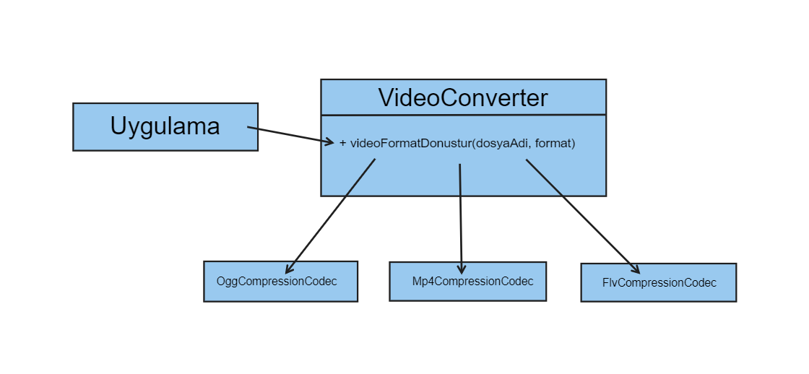

## Flyweight Design Pattern

Flyweight tasarım kalıbı, bir sistemde aynı tip nesnenin birçok örneğinin bulunması durumunda, nesnelerin ortak özelliklerini belirlemeyi ve bu ortak özellikleri kullanan ayrı bir sınıf oluşturarak RAM kullanımı azaltmayı amaçlar. 

Örneğin oyun kodlamaya merak saldığınızı varsayalım. Oyununuzda karakterinizin ormanda maceralar yaşamasını ve önüne gelen düşmanları öldürmesini istiyorsunuz. Orman, birçok ağaç sınıfından oluşacak, belki de onbinlerce ağaç sınıfından. Oyununuza önce ormanı oluşturarak başladınız. Ormanı oluşturduğunuzda gördünüz ki oyununuz bilgisayarınızın tüm RAM'ini kullanıyor. Daha oyuna düşmanları, karakterinizi ve diğer nesneleri eklemediniz bile. İşte burada imdadınıza Flyweight tasarım kalıbı yetişiyor. Flyweight tasarım kalıbı size şunu söylüyor. Ağaç nesnesinde ortak olarak kullandığının özellikleri ayrı bir sınıfa at ve bu özellikleri her ağaç nesnesi için terkar oluşturma, bu sınıf üzerinden eriş. Bu sayede RAM tasarrufu edeceksin.

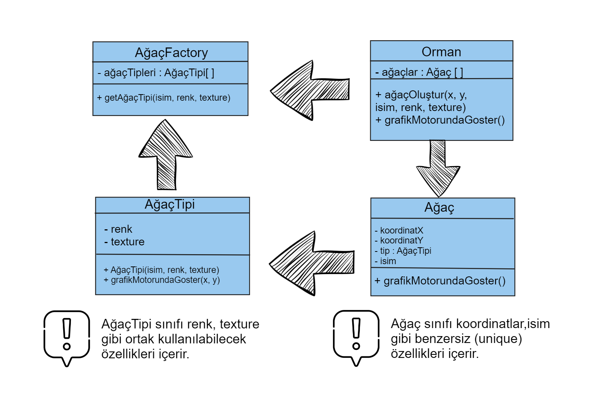

* Flyweight tasarım kalıbının sadece RAM sıkıntısı çeken sistemlerde kullanılması önerilir. Bu kalıbın kullanımı CPU kullanımını arttırmaktadır. Bir nevi RAM'den kazanılan yer CPU'da kaybedilir.

## Proxy Design Pattern

Proxy tasarım kalıbında bir nesnenin yerine başka bir nesne vekil olarak geçer. Bu tasarım kalıbı genellikle performansı iyileştirmek, günvenlik önlemi almak veya erişimi kontrol etmek amaçlı kullanılır. 

Bu tasarım kalıbının gerçek hayattaki anolojisini örnek vermek istersek Kredi Kartı örneğini verebiliriz. Kredi Kartı, aslında bir miktar parayı temsil eden bir vekil olarak düşünülebilir. Kart hem kullanıcıya kolaylık sağlar çünkü parasını yanında taşımak zorunda kalmaz. Hem de dükkan sahibine kolaylık sağlar. Çünkü parayı nakit olarak alsaydı kasaya koyacaktı ve bu durumda parasının çalınma riski olacaktı. Ancak kredi kartı ile ödeme yapıldığında para direk bankada dükkan sahibinin hesabına yatırılır. Proxy mantığıyla iki taraf da memnun edilmiş olur.

Kullanıcılara YouTube üzeriden bir video indirme servisi sunduğumuzu varsayalım. Birçok kullanıcı aynı videoya birden fazla indirme isteği gönderebilir. Bu videoları belirli bir süreliğine veritabanımızda saklayabiliriz. Araya bir proxy sınıf koyarak kullanıcıların aynı videoyu birden fazla indirmesini engelleyebiliriz. Bu sayede veritabanımızda gereksiz yer kaplamasını engellemiş oluruz.

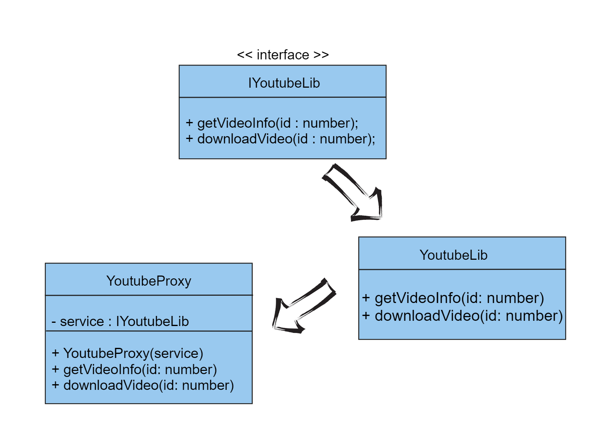

* Lazy Initialization işleminden kurtulmamızı sağlar. Böylelikle sistem kaynakları boşa harcanmaz.

* Log ve Cache işlemlerini kolaylaştırır.

* Smart Reference işlemi yapılabilir. Uzun bir zaman boyunca istek atılmayan referanslar bellekten atılabilir.

## Chain of Responsibility Design Pattern

Chain of Responsibility tasarım kalıbı bir dizi nesneyi birbirine işaretçiler(pointerler) aracılığıyla bağlayarak bir zincir oluşturur. Bu zincirdeki nesneler birbirlerine bağlıdır. Zincirin başındaki nesne istekleri alır ve istekleri zincirin sonuna kadar gönderir. Zincirin sonundaki nesne isteği işler ve cevap döndürür. Zincirin her bir nesnesi isteği kendisine gönderen nesneye cevap döndürmeden önce işlem yapabilir. Bu sayede istek zincirin herhangi bir yerinde işlenmiş olur.

Birbirlerine bağlı sınıfların tek bir sınıftan sorumlu olabileceği gibi yani zincir yapısı, ağaç yapısında da bu ilişkileri tasarlayabilirsiniz.

Gerçek hayat kullanımı ile ilgili bir örnek verecek olursak bir mağazanın online sipariş işlemlerini yöneten bir uygulama yazdığınızı varsayın. En başlarda uygulamanız kullanıcıların sisteme kayıtlı olup olmadıklarını kontrol ediyordu. Admin yetkisine sahip olanların sipariş oluşturmasına ve yönetmesine izin verirken kayıtlı kullanıcıların sipariş vermesine izin veriyordu. Daha sonra siber güvenlik uzmanı bir arkadaşınız verileri 'raw' haliyle sisteme geçirmenin güvenlik açısından zayıflık içerdiğini söyledi. Siz de verilerinize sanitization işlemi uyguladınız. Ama Authentication ve Sanitization işlemlerini aynı sınıf içerisinde kullandığınız için sınıf karmaşık bir hale gelmeye başladı.

Başka bir siber güvenlik uzmanı arkadaşınız da sisteminizin 'Brute Force' şifre kırma işlemleri için açık olduğunu söyledi. Aynı anda aynı IP'den gelen birçok istek olması halinde bu IP'yi banlamanız gerektiğini söyledi. Siz de bir IP kontrol sistemi yazmaya karar verdiniz. Ama sınıfınız zaten çok karmaşık bir haldeydi günlerce uğraşarak sistemi yazmayı başardınız. Bir gün başka bir arkadaşınız bir sistem açığı bulduğunu daha söyledi. Bu sefer siz, 'Lütfen Patrona söyleme.' şeklinde bir cevap vermek isteyebilirsiniz. Çünkü sınıfınıza bir doğrulama işlemi daha eklemek sizi çileden çıkarabilir. Chain of Responsibility tasarım kalıbı işte tam olarak burada işimize yaramaktadır. Her sınıf ayrı bir kontrol işlemi yapar ve kontrol sonucu olumluysa zincirin diğer halkasına geçer. Hatta bu uygulamada siz projeye başka bir güvenlik uzmanı alıp onun bu sınıfları yazmasını sağlayabilirsiniz. Size sadece zincirleri bağlama işlemi kalmış olur. 

Bu yönteme verebileceğimiz başka bir örnek ise bir süperkahraman takımı olabilir. Takımımız Superman, Batman ve Spider-Man üçlüsünden oluşsun ve takım kaptanımız Batman olsun. Batman kendisine bir komut gönderildiğinde bu komutu uygulayabiliyorsa uygular. Eğer uygulayamıyorsa komutu zincir yapısını kullanarak takım arkadaşlarına gönderir.

## Command Design Pattern

Command tasarım kalıbı, nesneye ait komutları ayrı sınıflar aracılığıyla yönetir. Böylece nesneye ait komutların erteleme ve sıraya alma gibi işlemlerini kolaylaştırır.

Bir notepad uygulaması tasarladığınızı düşünün. Uygulamanızda birçok arayüz butonu bulunacak ve bu butonlar backend kısmında farklı farklı işlemleri yönetmekten sorumlu olacaktır. Mesela 'Kaydet' butonu dosyayı işletim sisteminde bir klasöre kaydetmekten, 'Geri Al' butonu yazdığınız metnin bir önceki halini size döndürmekten sorumlu. Eğer siz bu işlemleri Buton sınıfları içerisinde tanımlarsanız Buton sınıfınız karmaşıklaşacaktır.  Projenizin büyüyüp geliştiği bir durumda yeni bir yazılımcı alırken Fullstack bir yazılımcıyı ekibi almanız gerecektir. Çünkü Backend ve Frontend işlemlerini aynı sınıflar üzerinden yazıyorsunuz. 

İşte böyle bir durumda Command tasarım kalıbını kullanabilirsiniz. Butonunuzun yapacağı Business Logic işlemleri ayrı bir fonksiyon sınıfı üzerinden yürütülür. Böylece SOLID prensiplerinden 'Single Responsibility' ve 'Open Closed' prensiplerine uygun bir yapı tasarlamış olursunuz.

* Command tasarım kalıbını bir komut çağrısını detaylandırmak için kullanabilirsiniz. Örneğin komut çağrısı birçok parametre alıyor ve bu parametrelere göre değişkenlik gösteriyor olabilir.

* Eğer kuyruğa alma veya erteleme gibi zamanlama(scheduling) işlemleriniz varsa Command tasarım kalıbını kullanabilirsiniz.

* Geri döndürülebilir operasyonlar kullanıyorsanız Command tasarım kalıbını kullanabilirsiniz. Sadece yapınıza CommandHistory sınıfı eklemeniz yeterli olacaktır.

## Memento Design Pattern

Memento (Hatırlatıcı) tasarım kalıbı ile bir nesnenin önceki durumlarını saklayabilir ve bu nesneyi istediğimiz zaman önceki formuna geri getirebiliriz. 

Bir metin editörü(notepad) uygulaması oluşturduğunuzu düşünün. Kullanıcıya Undo(Geri Alma) işlemlerini sunmak için ilk önce uygulamanızın nesne olarak bir kopyasını oluşturmayı ve bu kopyaları 'History' adında bir dizide kullanmayı düşündünüz. Sonra fark ettiniz ki uygulamanızın RAM kullanım oranı önemli bir biçimde artmış. Memento tasarım kalıbı size uygulamanızın önceki durumlarını saklamak için efektif bir yol sunar.

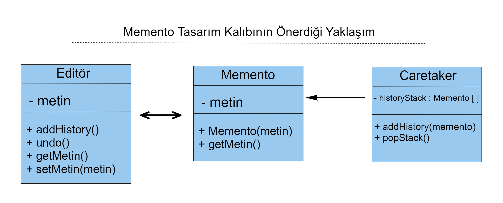

* Memento tasarım kalıbını bir nesnenin önceki durumlarını saklamak ve önceki formuna geri getirmek için kullanabilirsiniz.

* OOP prensiplerinden 'Encapsulation' ilkesini korumak istediğizde Memento tasarım kalıbını kullanabilirsiniz. Memento, nesneye hangi verileri saklayıp hangi verileri saklayamacağını kontrol etme hakkı verir.

* Memento tasarım kalıbını kullanmak RAM miktarını önemli ölçüde arttırabilir. Python, Javascript gibi dinamik diller Memento sınıfının içeriğinin değişmeyeceğini garanti etmez !

* Memento tasarım kalıbını Command tasarım kalıbı ile birlikte kullanabilirsiniz. Bu durumda Memento sınıfı Command sınıfının içerisinde olacaktır.

## Observer Design Pattern

Observer(Gözlemci) tasarım kalıbı, bir nesnenin değişikliklerini takip etmek ve nesne güncellendiğinde takipçi nesnelere bildirim göndermek için Abonelik(Subscription) modelini kullanır. 

Aslında bu tasarım kalıbı internet sayesinde günlük hayatta çokça karşılaştığımız bir tasarım kalıbıdır. Youtube'da abone olduğunuz bir kanal yeni bir video yayınladığında bildirim alırsınız. Twitter'da takip ettiğiniz bir kişi yeni bir tweet paylaştığında telefonunuza bildirim gelir. Bunun gibi pekçok örnek verebiliriz. Biz örneğimizi Youtube abonelik modeli üzerinden anlatacağız.

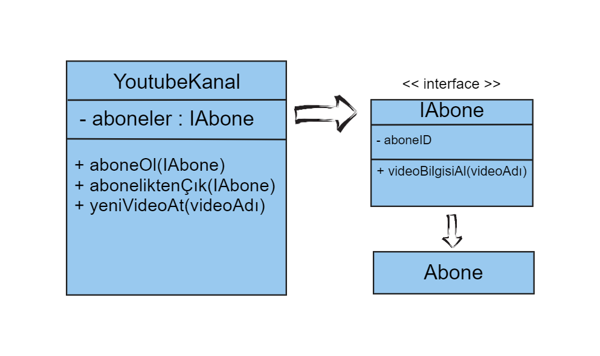

## Template Method Design Pattern

Template(Şablon) tasarım kalıbı bir sınıfın fonksiyonlarının iskeletlerini tanımlamasını ve geri kalan giydirme işleminin alt sınıflar tarafından yapılmasını sağlar. Böylece kod içerisindeki tekrarlamaları azaltır. Evet, yukarıdaki açıklamalar biraz karışık gibi görünüyor. Şimdi bu tasarım kalıbını bir örnekle açıklayalım.

Oyununuz için bir yapay zeka tasarladığınızı düşünelim. Oyununuz fantastik bir evrende geçsin. İçerisinde Orklar, Elfler, Canavarlar gibi birçok NPC için yapay zeka sınıfı yazacaksınız. Kodları yazarken fark edeceksiniz ki bu yapay zekaların birçok ortak noktası var. Hepsi belirli bir alan içerisinde düşmanları olup olmadığını kontrol ediyor, düşman varsa saldırıyor, düşman yoksa random bir yere hareket ediyor, düşmanı öldürdükten sonra lootluyor ya da düşmanın etini alıyor. Bu ortak noktaları bir sınıf içerisinde iskelet olarak belirleyip, alt sınıfların bu iskeleti doldurması için Template tasarım kalıbını kullanabiliriz.

## Visitor Design Pattern

Visitor(Ziyaretçi) tasarım kalıbı ile Visitor nesnesi başka bir nesne yapısındaki alanlara erişebilir. Hangi alanlara erişebileceği bu nesne tarafından belirlenir. Visitor tasarım kalıbını işlem yapacağımız nesnenin yapısını değiştirmemek ve Ziyaretçi sınıfı aracılığıyla nesnenin içeriğine erişip gerekli işlemleri yapmak istediğimizde kullanırız. 

Bir gerçek hayat anolojisi vermek istersek bir sigorta satıcısını örnek verebiliriz. Eğer sigorta satıcısı bir eve satış yapmaya gidiyorsa evin sahibine medikal sigorta yapmayı önerebilir. Eğer bir bankaya gidiyorsa banka sahibine hırsılık sigortası yapmayı önerebilir. Eğer bir kahve dükkanına gidiyorsa yangın sigortası yapmayı önerebilir. Yani sigorta satıcısı ziyaretçi sınıfıdır. Evin sahibi, bankanın sahibi ve kahve dükkanının sahibi ise ziyaret edilen nesnelerdir. Sigorta satıcısı ziyaret edilen nesnelerin içerisindeki alanlara erişebilir ve gerekli işlemleri yapabilir. Ama bu nesneleri değiştirmeye çalışmaz. 

Bu tasarım kalıbına bir örnek verelim. 'Şekil' isminde bir interface sınıfımız olsun. Bu sınıftan türeyen küp, dikdörtgenler prizması, silindir gibi 3 boyutlu snıflarımız var. Bu sınıfları kodlarken içerisine hacim bulma fonksiyonlarımızı yazmayı unuttuğumuzu düşünelim. Böyle bir durumda Visitor tasarım kalıbını kullanarak şekillerimize ait hacimleri bulabiliriz.

* Eğer sınıflarınız kompleks bir yapıya sahipse Visitor sınıfı aracılığıyla bu sınıflar üzerinde işlemler yapmak isteyebilirsiniz.

* Business Logic kısmını sınıflardan ayırmak istiyorsanız Visitor tasarım kalıbını kullanabilirsiniz.

* SOLID prensiplerinden 'Single Responsibility' ve 'Open Closed' prensiplerini uygulamak istiyorsanız Visitor tasarım kalıbını kullanabilirsiniz.

## Iterator Design Pattern

Iterator tasarım kalıbı ile bir sınıftaki değişkenlerin(list, stack, tree, queue vb.) elemanları üzerinde dolaşabiliriz. Peki bunu ayrı bir sınıf oluşturarak yapmamızın avantajı nedir? Eğer sınıfınız sadece liste yapısı kullanıyorsa bunu yapmanızın bir avantajı olmayabilir. Ama eğer sınıfınız ağaç yapısı gibi karmaşık yapıları kullanıyorsa bu tasarım kalıbını kullanmanızın avantajı olacaktır. 

Örneğin ağaç yapısının InOrder, PreOrder, PostOrder gibi farklı dolaşma yöntemleri vardır. Kullanıcı hangi dolaşma yöntemini istiyorsa o yöntemi kullanabilir. Başka bir sınıfta da ağaç yapısı uygulamış olabilirsiniz. Eğer bu Dolaşma(Iteration) yöntemlerini sınıf içerisinde tanımlarsak kodu her ağaç yapısı kullandığımız sınıfta tekrar tekrar yazmamız gerekecektir. Bu durumda kod tekrarına neden oluruz. 

## Mediator Design Pattern

Mediator tasarım kalıbı, bir grup nesnelerin birbiri ile iletişimi yöneten aracı bir sınıf oluşturur. Nesnelerin birbirlerine direkt olarak çağrı yapmasını engeller ve birbirine bağımlılıklarını azaltır. 

Gerçek hayat anolojisi(benzeşimi) olarak uçak-kule ilişkisini örnek verebiliriz. Uçaklar iniş izni için direkt olarak birbirleri ile iletişim kurmazlar. Bunun yerine her biri kule ile iletişim kurar. Kule iniş iznini uçaklara verir. Bir nevi kule aracılığıyla uçaklar arasındaki iletişim sağlanmış olur.

Yazılım dünyasından bir örnek vermek istersek bir arayüz uygulamasının bileşenleri arasındaki iletişimi örnek verebiliriz. Örneğin bir CheckBox'ınızın gizli bir TextBox'ı göstermesi gibi. Mesela 'Evli misiniz?' CheckBox'ını seçince 'Kaç Çocuğunuz Var?' TextBox'ının gözükmesi gibi. Eğer bu kontrolleri CheckBox veya TextBox sınıfları içerisinde kontrol etseydik bu arayüz bileşenlerinin birbirlerine bağımlılıkları oluşacaktı ve kod karmaşıklığı yaratacaktı. Bunun yerine bir Mediator(Aracı) sınıf ile bu bileşenler arasındaki iletişimi sağlayabilirdik. 

Biz daha kolay bir örnekle devam edelim. Örneğimizde kullanıcılar ve mesajlar arasında bir ilişki kuracağız. Kullanıcılar birbirleri ile mesajlaşabilirler. Mesajlaşma işlemini bir Mediator sınıfı aracılığıyla yapacağız.

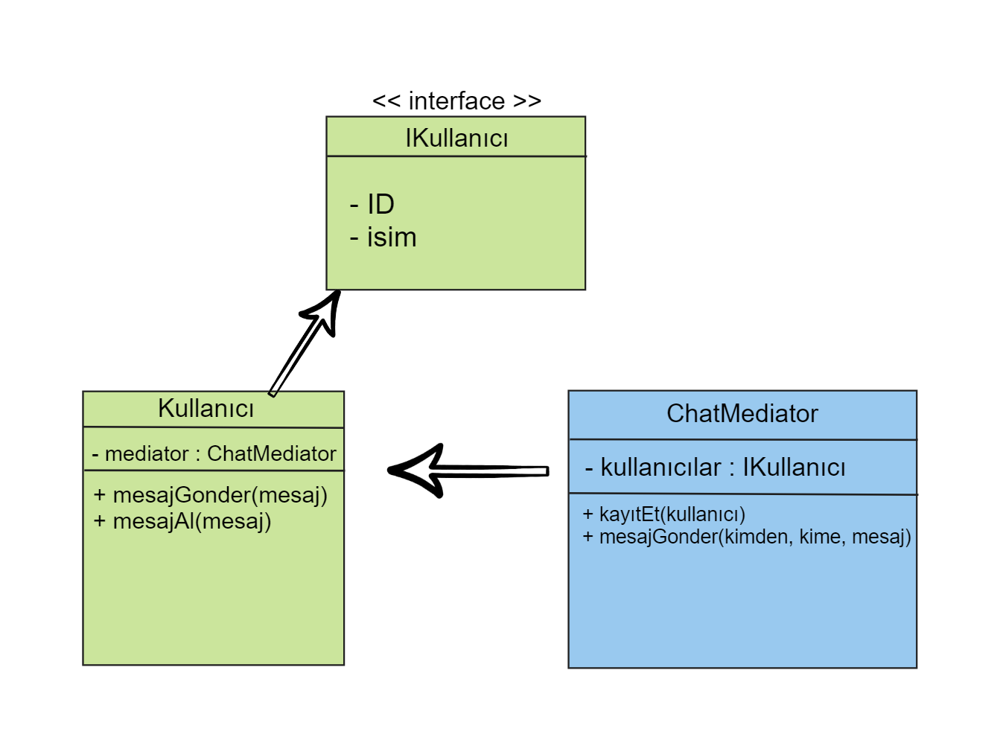

* Sınıflarınız başka sınıflara bağımlı olduğundan dolayı yapısını değiştiremiyorsanız Mediator tasarım kalıbını kullanabilirsiniz.

* Mediator tasarım kalıbı sınıflar arası bağımlılıkları azaltır. SOLID prensiplerinden 'Single Responsibility' ve 'Open Closed' prensiplerine uygun bir tasarım kalıbıdır.

## State Design Pattern

State tasarım kalıbı, bir nesnenin farklı durumları için farklı davranışlar sergilemesini sağlar. Nesnenin durum değişikliğine göre yapılacak işlemleri ayrı sınıflarda tanımlar. Bu tasarım kalıbı [Sonlu Durum Makinelerinin](https://tr.wikipedia.org/wiki/Sonlu_durum_makinesi)(Finite State Machines) çalışma mantığını kullanır. State tasarım kalıbı, sınıf için bir sonlu durum makinesi oluşturur. 

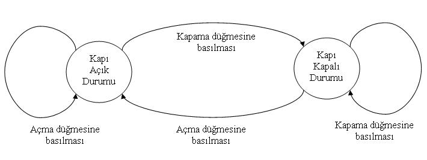

Bu konuya gerçek hayat anolojisi olarak telefonunuzun tuşlarını örnek verebiliriz. Telefonunuz kapalıyken power tuşu telefonunuzun ekranını açar. Ama telefonunuz açıkken aynı tuş kapama tuşu olarak çalışır. Telefonunuz kapalıyken ses açma-kapama tuşları herhangi bir işlem yapmaz. Ama açıkken sesi açar ya da kapatır. Telefonunuz içinde bulunduğu duruma göre farklı işlemler yaptığı için bir sonlu durum makinesine örnektir. 

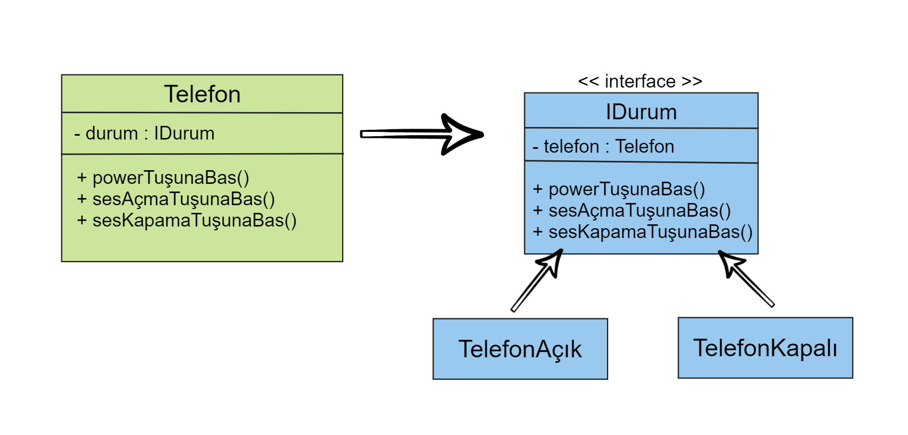

* Eğer bir sınıfınıza ait çok büyük sayıda durum varsa ve bu durumların her biri için farklı davranışlar sergilemesi gerekiyorsa State tasarım kalıbını kullanabilirsiniz. 

* Sınıfınız durum değişiklikleri yaparken çok fazla kod tekrarı yapıyorsa State tasarım kalıbını kullanabilirsiniz.

* Sınıfınıza ait sadece birkaç durum varsa State tasarım kalıbı aşırı yükleme yapmanıza neden olabilir ! Sadece birkaç durum için bu kalıbı kullanmayın.

* State tasarım kalıbı 'Single Responsibility' ve 'Open Closed' prensiplerine uygun bir tasarım kalıbıdır.
## Strategy Design Pattern

Strategy tasarım kalıbı bir nesnenin farklı davranışlarını tanımlayan sınıfları kullanarak nesnenin davranış değiştirmesini sağlar. 

Bir gerçek hayat anolojisi verirsek bir lokasyondan başka bir lokasyona gideceğinizi varsayın. Bunun için kullanabileceğiniz birçok yol var. Yani birçok 'Stratejiniz' var. Bisiklet ile gidebilirsiniz daha çok zaman alıcı ama daha ucuz. Otobüs ile gidebilirsiniz hem hızlı hem de ucuz. Taksi ile gidebilirsiniz diğer alternatiflerden hızlı ama daha pahalı. Seçebileceğiniz birçok strateji var.

Yazılım dünyasından bir örnek verirsek bir sıralama algoritması yazıyorsunuz. Elinize bazen dağınık veriler bazen neredeyse sıralı veriler gelebilir. Bu durumda sıralama algoritmasını değiştirmek isteyebilirsiniz. Çünkü Insertion Sort neredeyse sıralı veriler için daha hızlı çalışır. Quick Sort ise dağınık veriler için daha hızlı çalışır. İşte bu durumda Strategy tasarım kalıbını kullanabilirsiniz.

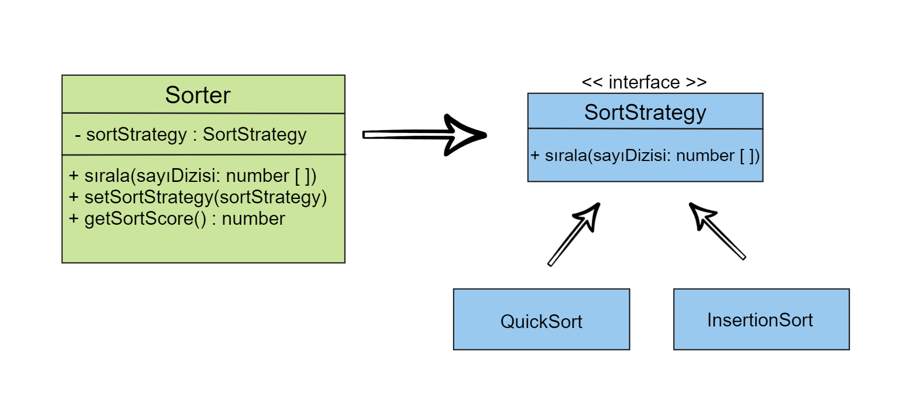

* Eğer bir nesne içerisinde birden fazla algoritma kullanmak istiyorsanız Strategy tasarım kalıbını kullanabilirsiniz.

* Eğer Business Logic kısmını sınıftan ayırmak istiyorsanız Strategy tasarım kalıbını kullanabilirsiniz.

* Eğer sadece birkaç tane algoritmanız varsa Strategy tasarım kalıbını kullanmayın ! Bu durumda Strategy tasarım kalıbı sadece kod tekrarına neden olur.

* Strategy tasarım kalıbı 'Open Closed' prensibine uygun bir tasarım kalıbıdır.

## License

MIT License

## Acknowledgments

Herhangi bir sorunuz ya da yazılarda gördüğünüz bir hata olursa bana email atabilirsiniz.

---

> Email [muhammetzahitaydin@gmail.com](muhammetzahitaydin@gmail.com) &nbsp;&middot;&nbsp;
