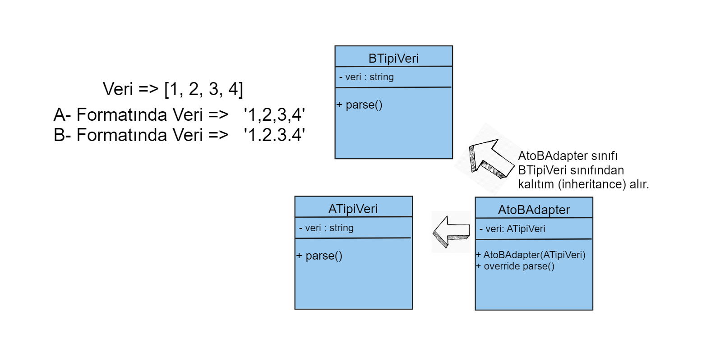
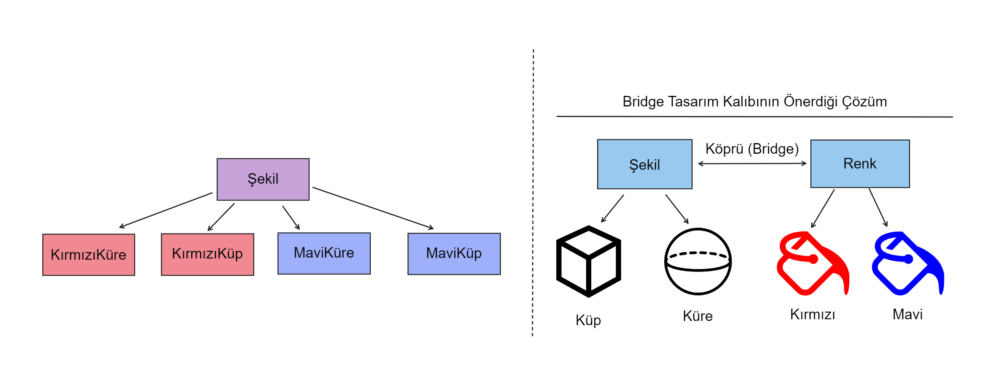
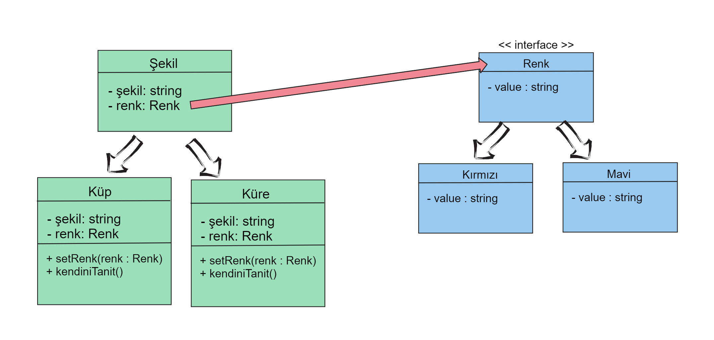
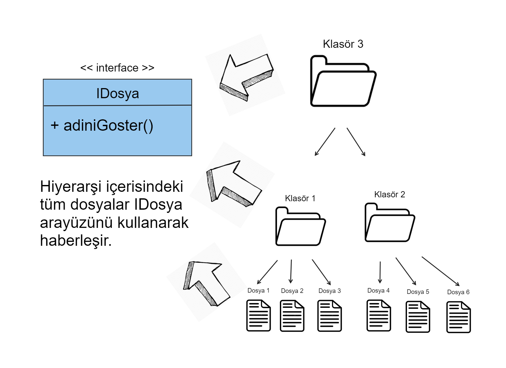

<h1 align="center">
  <br>
  Tasarım Kalıpları
  <br>
</h1>

<h4 align="center">[Project's description]</h4>


<ol>
  <li>
  <a href = '#factory-method-design-pattern'>Factory Method Design Pattern</a>
  </li>
  <li>
  <a href = '#abstract-factory-design-pattern'>Abstract Factory Design Pattern</a>
  </li>
  <li>
  <a href = '#builder-design-pattern'>Builder Design Pattern</a>
  </li>
  <li>
  <a href = '#prototype-design-pattern'>Prototype Design Pattern</a>
  </li>
  <li>
  <a href = '#singleton-design-pattern'>Singleton Design Pattern</a>
  </li>
  <li>
  <a href = '#adapter-design-pattern'>Adapter Design Pattern</a>
  </li>
  <li>
  <a href = '#bridge-design-pattern'>Bridge Design Pattern</a>
  </li>
  <li>
  <a href = '#composite-design-pattern'>Composite Design Pattern</a>
  </li>
  <li>Second item</li>
  <li>Third item
    <ol>
      <li>Indented item</li>
      <li>Indented item</li>
    </ol>
  </li>
  <li>Fourth item</li>
</ol>

<p align="center">
  <a href="#about">About</a> •
  <a href="#key-features">Key Features</a> •
  <a href="#getting-started">Getting Started</a> •
  <a href="#faq">FAQ</a> •
  <a href="#roadmap">Roadmap</a> •
  <a href="#support">Support</a> •
  <a href="#license">License</a>
</p>

## Factory Method Design Pattern

Factory Metodunu bir günlük hayat senaryosu ile açıklamaya çalışacağız. Bir lojistik şirketi için nakliye kamyonlarına ait bir ekosistemi programladığınızı düşünün. Nesne yönelimli kodunuzu "Kamyonet" isimli bir sınıfa(class) göre kurduğumuzu düşünelim. 

İşler iyi gitti ve çalıştığınız şirket aksiyonlarını büyütmeye karar verdi. Artık şirketiniz deniz nakliyesi yapmak amacıyla gemiler ile de çalışıyor. Bu gemileri ekosisteminize dahil etmeniz gerek ama siz kodunuzu "Kamyonet" nesne yönelimli yapınızı kamyonet sınıfı üzerine kurgulamıştınız. Bu durumda gemileri ekosisteminize dahil etmek için kodunuzu değiştirmek zorunda kalacaksınız. Bu durumda kodunuzun esnekliğini kaybedeceksiniz. Belki de binlerce satır kodunuzu değiştirmek ve günlerce hata ayıklamak zorunda kalacaksınız :(

Factory Metodu tam da bu gibi durumlara uygun bir tasarım kalıbıdır. Eğer elinizde sürekli genişleyen veya genişleyebilecek bir ekosistem varsa bu kalıbı kullanabilirsiniz. 


Factory Metodu bu sorunu çözmek için obje oluşturma işlemlerimizi özel bir sınıfa(class) taşır. Bu sınıfın adı "Fabrika" olabilir. Bu fabrika sınıfı içerisinde obje oluşturma işlemlerimizi gerçekleştiririz. Ama bu işlemi yaparken objelerimizi aynı interface üzerinden türetmeliyiz.


Yukarıdaki verdiğimiz senaryodaki kişi bu yapımızı en baştan uygulasaydı, nakliye şirketi operasyonlarını büyütmek istediğinde bir sıkıntı yaşamayacaktı. Sadece yeni sınıflar ekleyerek işlerini halledebilirdi. 

##### Factory Pattern Kullanım Senaryoları

- Eğer kullanacağınız sınıfları önceden tam olarak bilmiyorsanız
- Eğer kullanıcılara geliştirip büyütebilecekleri bir kütüphane veya framework sunmak istiyorsanız
- Sistem kaynaklarından tasarruf etmek ve her seferinde bir sınıfı sıfırdan yazmak istemiyorsanız

! Factory Methodun tek eksiği kodunuzu karmaşıklaştırmasıdır ama bunun dışında çok kullanışlı bir tasarım kalıbıdır.

## Abstract Factory Design Pattern

Abstract Factory Metodu birbirine bağlı olan nesneleri üretmek için kullanılır. Örneğin bir araba üretirken motor ve tekerlekleri de üretmeliyiz. Yani elimizde belirli bir kalıp var. Bu durumda terimsel olarak abstract kelimesini kalıp olarak çevirilebilir.

Metodumuzu yine bir günlük hayat senaryosuyla açıklamaya çalışalım. Bir antika dükkanının satış uygulamasını kodladığınız düşünün. Dükkanda şimdilik Osmanlı ve Viktorya stili mobilyalarımız bulunsun. Bu mobilyaların hepsinin ortak özellikleri var. Bunlar; "Koltuk", "Sandalye" olabilir. Ama bu mobilyaların hepsinin ortak özellikleri dışında farklı özellikleri de var. Örneğin Osmanlı stili koltuklarımızın koltuk kısmı deri olabilir. Viktorya stili koltuklarımızın koltuk kısmı ise kumaş olabilir. Eğer programımızı sadece bu 2 tip mobilyaya göre tasarlamış olsaydık, her yeni mobilya tipi için kodumuzu değiştirmek zorunda kalacaktık. Bu durumda kodumuzun esnekliğini kaybedecektik.

Ayrıca uygulamayı yaparken ekibimizde 2 yazılımcı daha çalıştığını varsayalım. Bu yazılımcılardan birinin müşterilere satış yapılan sayfayı kodladığını diğerinin ise ürünün nakliyesi ile işlemleri kodladığını düşünelim. Bu durumda sınıfların hiyerarşik yapısını kodlamak size ait olacaktır. Projede çalışan diğer yazılımcılar sizden kolay bir kullanım arayüzü, bir nevi API bekleyecektir. Böyle bir senaryoda Abstract Factory Metodu size yardımcı olacaktır.


Abstract Factory Metodu isminden de anlaşılacağı üzere Factory Metodu ile benzerlik gösterir. Factory Metodundan farklı olarak clien'ın (yukarıda verdiğimiz senaryoda diğer yazılımcıların) sadece abstract sınıf ile muhatap olmasını sağlar. Yukarıdaki şemada nakliyeci taşıdığı mobilyaların tipleri ile ilgilenmez. Sadece mobilya sınıfı ile muhatap olur. Bu sayede client'ın kodu daha düzenli olur. Ayrıca yeni bir mobilya tipi eklenmesi durumunda client'ın kodunu değiştirmek zorunda kalmazsınız. Sadece yeni mobilya sınıfını yazmanız yeterli olacaktır. 

Bu metod biraz karışık olduğu için bir örnek daha verelim. Platform bağımsız bir arayüz uygulamamız olsun. Arayüz bileşenlerimiz Windows ve Mac için farklı olabilir. Mesela butonlarımız Windows için 3D, Mac için ise 2D olabilir. Bunlar için ayrı ayrı sınıflar yazmak yerine Abstract Factory Metodu ile tek bir sınıf içerisinde iki farklı sınıfı üretebiliriz. Bu sayede client'ın kodunu değiştirmek zorunda kalmadan yeni bir platform ekleyebiliriz. 


Abstract Factory &nbsp; &nbsp; &nbsp; &nbsp; &nbsp; &nbsp; &nbsp; &nbsp; &nbsp; &nbsp; &nbsp; &nbsp; &nbsp; &nbsp; &nbsp;&nbsp; &nbsp; &nbsp; &nbsp; &nbsp; &nbsp; | Factory Method
-------|-------------------
Bir dizi benzer ürünleri oluşturmak için kullanılabilir. Örneğin bir otomobil üreticisi, farklı otomobil modelleri oluşturmak için abstract factory kullanır. | Bir ürün sınıfının alt sınıflarını oluşturmak için kullanılır. Örneğin bir otomobil üreticisi, aynı otomobil modelinin farklı tasarımlarını oluşturmak için kullanır.
Sınıf yapısı daha kapsamlıdır. | Genellikle tek metot içerir.
Daha az özelleştirilebilir bir yapıya sahiptir çünkü belirli bir kalıba bağlıdır. | Daha fazla özelleştirme imkanı sunar.

## Builder Design Pattern

Builder metodu bir nesnenin oluşturulması sırasında aşamaları açıkça ayırır ve bu şekilde nesne oluşturma işlemini daha okunaklı ve anlaşılır bir kod yapısına döker. Aynı nesne oluşturma kalıbını kullanarak birçok farklı tipte objeler üretmenizi sağlar.

'Ev' isimli bir nesne kodladığınızı düşünün. 'Ev' nesnesinin pencereSayısı, odaSayısı, katSayısı, çiftKatlıMı, garajıVarMı, havuzuVarMı, BahçesiVarMı, DoğalGazBağlıMı ... gibi birçok özelliği vardır. Bu nesneyi oluştururken fark edeceksiniz ki constructor fonksiyonunuz çok uzun ve karmaşık bir hal almış yani 'Telescoping Constructor' probleminden muzdaripsiniz. Kodu siz yazdığınız halde sizin bile yeni bir ev nesnesi tanımlarken kafanız karışıyor.


Builder metodu bu karmaşıklığı önlemede size yardımcı olacaktır. Çalışma metodu olarak nesne oluşturma işlemini aşamalara bölme prensibini benimser. Bu aşamaları birer fonksiyon olarak tanımlar ve bu fonksiyonları kullanarak nesneyi oluşturur. Bu sayede nesne oluşturma işlemini daha okunaklı ve anlaşılır bir kod yapısına döker. Aynı nesne oluşturma kalıbını kullanarak birçok farklı tipte objeler üretmenizi sağlar.


* Builder metodu, 'Single Responsibility' prensibine uygun bir tasarım desenidir. Nesneyi oluştururken kompleks adımları birbirinden ayırırız ve her adımdan sorumlu tek bir fonksiyon tanımlarız.

## Prototype Design Pattern

Prototype tasarım kalıbı varolan bir nesnesin kopyası alır ama sizi o sınıfa olan bağımlılıktan kurtarır. 

Diyelim kodunuz içerisinde bir sınıf üzerinde testler yapmak istiyorsunuz ve sınıfınızın bu testlerden etkilenmesini istemiyorsunuz. Bu durumda kod içerisinde bu sınıfı bulup kodlarını kopyalayıp yeni bir sınıf oluşturmayı aklınıza getirdiyseniz bunun kötü bir yaklaşım olacağını söyleyelim. Eğer bu şekilde kopyala yapıştır yaparsanız yeni sınıfınız eski sınıfın tüm bağımlılıklarını kopyalacaktır. Bunun yapacağınız testlere etki edeceğini söyleyebiliriz.

Prototype tasarım kalıbı klonlama işlemlerini destekleyen tüm fonksiyonlar için bir ortak interface sunar. Böylece siz sınıfı tek bir clone() fonksiyonuyla klonlamış olursunuz ve bağımlılıklarınızı kopyalamazsınız. Hatta birçok programlama dili aynı sınıftan türetilmiş nesnelerin private özellikleri kopyalamasını desteklediğinden dolayı private değişkenleri kopyalayabilirsiniz. 


* Prototype tasarım kalıbını kopyalamak istediğiniz sınıfın 'Concrete' sınıfa bağımlı olmasını istemediğinizde kullanabilirsiniz. 

* Prototype tasarım kalıbını sadece başlatılma(initialize) biçimleri değişen birçok alt-sınıfı azaltmak istediğinizde kullanabilirsiniz. 

## Singleton Design Pattern

Singleton tasarım kalıbı, bir sınıfı ait sadece bir nesne oluşturulmasını sağlar. Oluşturulan tek nesne global tanımlanan bir işaretçi(pointer) üzerinden erişilebilir.

Bir sınıfa ait tek bir nesne olmasını neden isteyebiliriz ? Bazı paylaşılan kaynaklara erişmek istediğimizde bu kalıbı kullanabiliriz. Örneğin bir veritabanı bağlantısı, bir dosya sistemi, bir log kaydı gibi. Bu kaynaklara erişmek amacıyla her nesne için ayrı bir nesne oluşturmak yerine tek bir nesne üzerinden erişmek daha mantıklı olacaktır. Birden fazla nesnemiz olsaydı bir nesne üzerinde değişiklik yaptığımızda diğerleri üzerinde de yapmak zorunda kalacaktık. Bu özelliği sınıfların constructor fonksiyonları ile yapamayız. Constructor fonksiyonları sınıfın herhangi bir nesnesi oluşturulduğunda çalışır. Bu nedenle sınıfın tek bir nesnesi oluşturulmasını sağlamak için sınıf içerisinde static bir değişken tanımlarız.


* Singleton tasarım kalıbını bir sınıfın sadece tek bir nesnesi olmasını istediğinizde kullanabilirsiniz. Global değişkenler yerine bu kalıbı kullanabilirsiniz. Global değişkenlerin aksine Singleton kalıbı nesnenin tanımlandığını garanti eder. Uygulanması kolay bir tasarım kalıbıdır.

* Singleton tasarım kalıbı 'Single Responsibility' prensibini ihlal eder. Programınızın Multithread bir çalışma yapısı varsa nesnenin iki kez tanımlanamayacağından size sıkıntı çıkarabilir. 

* Birçok framework Unit Test yazımında Miras Alma(Inheritance) özelliğini kullandığından Singleton metodlarının bir kopyasını oluşturamaz. Bu yüzden de Singleton metodlarını Unit Test yazarken kullanamazsınız.


## Adapter Design Pattern

Adapter tasarım kalıbı, bir sınıfın üyelerini başka bir sınıfın üyelerine uyumlu hale getirme amacı ile kullanılan bir tasarım kalıbıdır. Bu tasarım deseni, farklı sınıflar arasında uyumsuzluğu azaltır veya ortadan kaldırır.

Gerçek hayatta birçok durumda farklı sınıflar arasında uyumsuzluklar oluşur. Örneğin borsayı takip eden bir uygulamanız olsun. Siz verilerinizi bir API üzerinden XML formatında alıyorsunuz ama kullandığınız istatistik kütüphanesi ya da verileri göstermek için kullandığınız grafik kütüphanesi JSON formatında verileri kabul ediyor. Bu durumda verileri XML formatından JSON formatına çevirmeniz gerekecektir. Bu çevirme işlemini yapmak için bir adapter tasarım kalıbı kullanabilirsiniz.

Biz bu kadar geniş çaplı bir örnek yapmayacağız. Örneğin A ve B isimli veri saklamak için kullandığımız iki formatımız olsun. A formatında verileri virgülle ayırıp dosyaya yazarken B formatında verileri noktayla ayırıp dosyaya yazıyoruz. Bu iki formatı birbirine uyumlu hale getirmek için bir adapter tasarım kalıbı kullanabiliriz.



* Adapter Metodu 'Single Responsibility' prensibi ile uyumludur. Sınıflar arası uyum işlemini tek bir ara sınıfa yüklemiş oluruz. 
* Adapter Metodu 'Open/Closed' prensibini benimser. Önceden oluşturulmuş sınıflar üzerinde değişiklik yapmadan yeni Adapter sınıfları ekleyebiliriz. 

## Bridge Design Pattern

Bridge tasarım kalıbı, büyük bir sınıfı ya da küçük sınıflardan oluşan bir yapıyı 'Abstraction' ve 'Implementation' olarak iki farklı hiyerarşiye ayırmayı amaçlar. Bu ayırma işleminden sonra iki farklı grup birbirinden bağımsız olarak geliştirilebilir. 

Basit bir örnekle açıklamak istersek diyelim ki 'Şekil' isimli bir interface sınıfımız olsun. Bu sınıftan renklere ve şekillere göre sınıflar türetmek istiyoruz. Mesela şekillerimiz Küp, Küre olsun renklerimiz de Mavi, Kırmızı olsun. Bu durumda 4 sınıfımız ortaya çıkacaktır. (MaviKüp, KırmızıKüp ...)

Bu şekilde sınıflarımızı oluşturduğumuzda yeni bir şekil eklemek istediğimizde ya da yeni bir renk eklemek istediğimizde sınıflarımızın sayısı artacaktır. Bu iki özelliği ayrı ayrı sınıf kümelerine ayırsak ve birbiri ile ilişki kursaydık bu sorunu çözebilirdik. 



Bu kalıbın gerçek hayatta kullanımına bir örnek verecek olursak platform bağımsız bir yazılım geliştiriyorsunuz. Bu yazılımı Windows, Linux ve Mac OS için geliştirmek istiyorsunuz. Bu durumda yazılımınızı platform bağımsız yani sadece uygulamayı geliştirdiğiniz kısıma ve platforma bağlı fonksiyonları ve sınıfları yazdığınız kısım olarak iki ayrı bölüme ayırabilirsiniz. Bu iki kısımdan biri değiştiğinde diğer kısımda değişiklik olmayacaktır. Hatta bu tasarım kalıbı ile birlikte bu kısımlar ayrı yazılım ekipleri tarafından geliştirilebilir. 



Konuya veribileceğimiz bir diğer örnek ise kumanda ve televizyon-radyo arasındaki örnek verilebilir. Kumanda, Bridge tasarım kalıbının Abstraction kısmı, Televizyon veya Radyo ise Implementation kısmını oluşturur. Kumanda sınıfı televizyon ve radyo sınıflarından bağımsız olarak geliştirilir. 


* Bridge tasarım kalıbını bir sınıf kümeniz birçok farklı sınıf kümesi ile ilişki kuruyorsa kullanabilirisiniz. Örneğin birçok veritabanı sistemine bağlanan bir sınıf kümeniz varsa. 

* Bridge tasarım kalıbını platform bağımsız uygulamalar ve sınıflar yazmak için kullanabilirsiniz. 

* Bridge tasarım kalıbı, SOLID presiplerinden 'Open/Closed' ve 'Single Responsibility' ilkelerini benimser.

## Composite Design Pattern

Composite tasarım kalıbı, birbirlerine hiyerarşik olarak bağlı nesneleri bir ağaç yapısında birleştirmeyi amaçlar. Birbirlerine bağlı düğümler ortak bir interface üzerinden işlemler yaparlar.
Oluşturduğumuz hiyerarşik yapıda 'Leaf'(yaprak) ve 'Composite'(bileşik) olarak iki farklı sınıf yapısı bulunur. Leaf sınıfı hiyerarşik yapının en alt seviyesindeki sınıftır. Composite ise kendisinden türeyen sınıfları birbirine bağlayan sınıftır. 

Gerçek hayatta benzer bir yapıyı orduda görebiliriz. Ordu içerisinde mutlak bir hiyerarşi bulunmaktadır. Bu hiyerarşide en üst seviyede komutanlar bulunur. Komutanlar altında da subaylar bulunur. Subaylar altında da askerler bulunur. Bu hiyerarşideki her bir sınıf kendisinden türeyen sınıfları birbirine bağlar. Komutanın verdiği emir subaylara ulaşır. Subaylar da bu emiri sorumlu olduğu askerlere ulaştırır. 


Yazılım konusunda verilebileceğimiz bir örnek ise dosya sistemi olabilir. Dosya sisteminde en üst seviyede klasörler bulunur. Klasörler altında dosyalar bulunur.



* Composite tasarım kalıbını uygulamanız bir ağaç yapısıyla ifade edilebilirse kullanın. 

* Composite tasarım kalıbını kompleks ve basit birimlere aynı interface üzerinden erişmek istediğinizde kullanabilirsiniz.

* Composite tasarım kalıbı ile karmaşık ağaç yapısı fonksiyonlarını kullanabilirsiniz. PolyMorphism ilkesini ve Recursive fonksiyonlarını lehinize kullanabilirsiniz.

* Composite tasarım kalıbı, SOLID prensiplerinden 'Open/Closed' ilkesini benimser.


## About

Simple overview of use/purpose.

## Key Features

- Feature 1
- Feature 2
  - Feature 2.1
  - Feature 2.2
- Feature 3

## Getting Started

This is an example of how you may give instructions on setting up your project locally. To get a local copy up and running follow these simple example steps.

### Prerequisites

This is an example of how to list things you need to use the software and how to install them.

- npm

### Installing and Running

Below is an example of how you can instruct your audience on installing and setting up your app. This template doesn't rely on any external dependencies or services.

```bash
# Clone this repository
$ git clone https://github.com/[your-github-user]/[your-repository-name]

# Go into the repository
$ cd [your-repository-name]
```

## FAQ

### Is it any good?

[yes.](https://news.ycombinator.com/item?id=3067434)

## Roadmap

- [x] Add this README.
- [ ] Finish the unicorn project.

## Emailware

[Project's name] is an [emailware](https://en.wiktionary.org/wiki/emailware). Meaning, if you liked using this app or it has helped you in any way, I'd like you send me an email at <your-email@email.com> about anything you'd want to say about this software. I'd really appreciate it!

## Contributing

Contributions are what make the open source community such an amazing place to learn, inspire, and create. Any contributions you make are **greatly appreciated**.

If you have a suggestion that would make this better, please fork the repo and create a pull request. You can also simply open an issue with the tag "enhancement".
Don't forget to give the project a star! Thanks again!

1. Fork the Project
2. Create your Feature Branch (`git checkout -b feature/AmazingFeature`)
3. Commit your Changes (`git commit -m 'Add some AmazingFeature'`)
4. Push to the Branch (`git push origin feature/AmazingFeature`)
5. Open a Pull Request

## Support

You can also support us by:

<p align="left">
  <a href="https://www.buymeacoffee.com" target="_blank"></a> &nbsp &nbsp
  <a href="https://www.patreon.com">
    
  </a>
</p>

## License

Your license here.

## Acknowledgments

Inspiration, code snippets, etc.

- [Markdownify's README](https://github.com/amitmerchant1990/electron-markdownify#readme)

## You may also like...

List of apps or libs that do similar stuff as your project.

- [Best-README-Template](https://github.com/othneildrew/Best-README-Template)
- [Simple README.md template](https://gist.github.com/DomPizzie/7a5ff55ffa9081f2de27c315f5018afc)

---

> [abehidek.me](https://abehidek.me) &nbsp;&middot;&nbsp;
> GitHub [@abehidek](https://github.com/abehidek) &nbsp;&middot;&nbsp;
> Twitter [@guilhermehabe](https://twitter.com/guilhermehabe)
